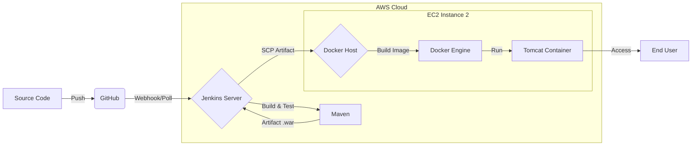

# 🚀 CI/CD Pipeline: AWS + Jenkins + Docker + Maven

[](https://jenkins.io/)
[](https://www.docker.com/)
[](https://aws.amazon.com/)
[](https://maven.apache.org/)

**Automated deployment of a Java Web Application on Docker Containers using a Jenkins CI/CD Pipeline on AWS EC2.**

---

## 🏗️ Architecture Overview



---

## 📋 Project Agenda

1.  **Infrastructure Setup**: Provision AWS EC2 instances.
2.  **Toolchain Configuration**: Install & Setup Jenkins, Git, and Maven.
3.  **Environment Integration**: Connect GitHub and Maven with Jenkins.
4.  **Docker Orchestration**: Setup Docker Host and customize containers.
5.  **Pipeline Automation**: Automate end-to-end Build & Deploy process.
6.  **Verification**: Test the live application.

---

## 🛠️ Step-by-Step Implementation

### Phase 1: Infrastructure Setup (AWS EC2)

1. **Launch Jenkins Server**:
    - Instance: Linux EC2 (t2.micro).
    - Security Group: Allow SSH (22) and Jenkins (8080).
2. **Access & Install Jenkins**:
    - Connect via SSH.
    - Install Java OpenJDK 11 and Jenkins.
    - Access via `http://<EC2-IP>:8080`.

<details>
<summary>📂 View Setup Commands & Screenshots</summary>


```bash
# Register Repo
sudo wget -O /etc/yum.repos.d/jenkins.repo https://pkg.jenkins.io/redhat-stable/jenkins.repo
sudo rpm --import https://pkg.jenkins.io/redhat-stable/jenkins.io-2023.key

# Install Dependencies
sudo yum install java-11-openjdk -y
sudo yum install jenkins -y
sudo systemctl enable --now jenkins
```
</details>

---

### Phase 2: Tool Configuration (Git & Maven)

1. **Git Integration**:
    - Install Git on Jenkins EC2.
    - Install `GitHub Integration` plugin in Jenkins.
2. **Maven Setup**:
    - Download and extract Maven in `/opt`.
    - Configure Environment Variables (`JAVA_HOME`, `M2_HOME`).
    - Setup "Global Tool Configuration" in Jenkins.

<details>
<summary>📂 View Configuration Details</summary>


```bash
# Maven Setup
cd /opt
sudo wget https://archive.apache.org/dist/maven/maven-3/3.8.6/binaries/apache-maven-3.8.6-bin.tar.gz
sudo tar -xvzf apache-maven-3.8.6-bin.tar.gz
```
</details>

---

### Phase 3: Docker Host Orchestration

1. **Provision Docker Host**:
    - Launch separate Linux EC2.
    - Install & Start Docker Engine.
2. **Customize Tomcat Image**:
    - Docker default Tomcat images often have empty `webapps` folders.
    - Create a custom `Dockerfile` to fix the 404 error by copying `webapps.dist` to `webapps`.

<details>
<summary>📂 View Docker Customization</summary>


**Custom Dockerfile:**
```dockerfile
FROM tomcat:latest
RUN cp -R /usr/local/tomcat/webapps.dist/* /usr/local/tomcat/webapps
COPY ./*.war /usr/local/tomcat/webapps
```
</details>

---

### Phase 4: CI/CD Pipeline Automation

1. **Integrate Jenkins with Docker**:
    - Create `dockeradmin` user on Docker Host.
    - Install `Publish Over SSH` plugin on Jenkins.
    - Configure SSH settings to connect Jenkins to Docker Host.
2. **Create Pipeline Job**:
    - Set Source Code Management (GitHub URL).
    - Configure "Build Periodically" or "GitHub hook trigger".
    - **Post-build Action**: Send artifacts over SSH and execute deployment commands.

<details>
<summary>📂 View Automation Script</summary>

**Execute over SSH:**
```bash
cd /opt/docker;
docker stop registerapp || true;
docker rm registerapp || true;
docker build -t regapp:v1 .;
docker run -d --name registerapp -p 8087:8080 regapp:v1
```
</details>

---

## ✅ Deployment Success

Once the pipeline runs, your application is live!


Access the app: `http://<Docker-Host-IP>:8087/webapp/`

---

## 🏁 Conclusion

This project demonstrates a robust CI/CD workflow, bridging the gap between developers and production using modern DevOps tools on AWS cloud infrastructure.

---
*Maintained by [Heman](https://github.com/hemanshuu)*
